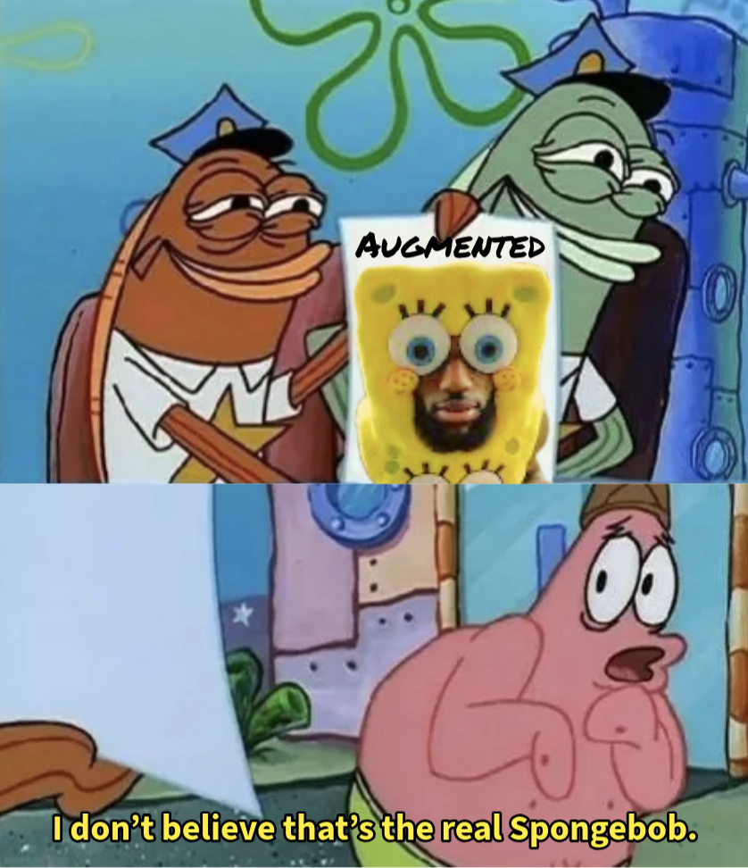
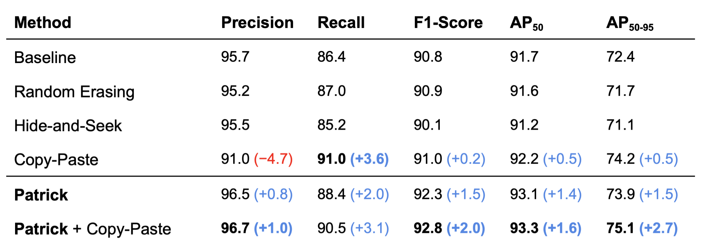
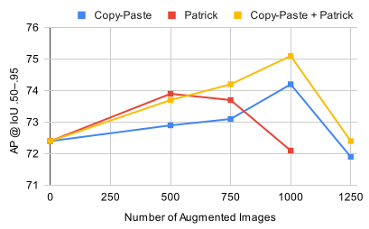
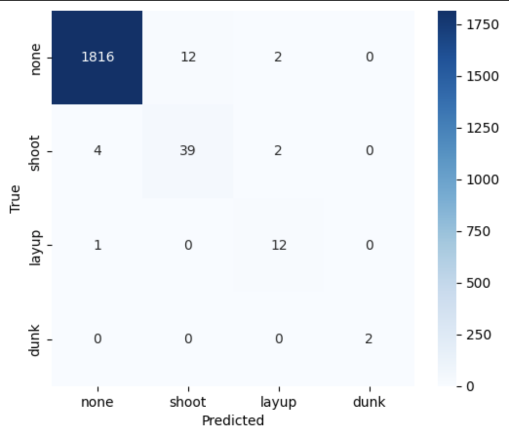

<a id="readme-top"></a>
## LePatrick Image Augmentation for Enhanced Detection & Clipping



Meet Mr. Dr. Professor Patrick — the ultimate game-changer in image augmentation! 🎩✨

This project revolutionizes object detection and takes LeBron’s highlight clipping to the next level, turning ordinary moments into unforgettable slam-dunk spectacles.

🔥🔥🔥 Dive into the repo and discover how this unexpected combo works wonders!

<br/>
<div>
	
	
	
	
	
</div>

<br/>

### Table of Contents
- [Overview - Who're you callin pinhead?!](#-overview---whore-you-callin-pinhead)
	- [How It Works](#how-it-works)
	- [Results & Comparison](#results--comparison)
	- [Highlight Clipping](#highlight-clipping)
- [Sample Outputs - LEEDLE LEEDLE LEEDLE LEE!](#-sample-outputs---leedle-leedle-leedle-lee)
- [Usage - We're not cavemen... WE HAVE TECHNOLOGY!](#-usage---were-not-cavemen-we-have-technology)
	- [Prerequisites](#prerequisites)
	- [Installation](#installation)
	- [Basic Example](#basic-example) 
- [License - We should take Bikini Bottom, and push it somewhere else!](#-license---we-should-take-bikini-bottom-and-push-it-somewhere-else)
- [Contact - Marty?! Janet?! Who are you people?!](#-contact---marty-janet-who-are-you-people)

<br/>

## ⭐ Overview - Who're you callin pinhead?!

This project playfully pushes the boundaries of image augmentation to seriously amp up object detection and give highlight clipping a major upgrade, bringing you LeBron's epic moments like never before.

### How It Works

The augmentation pipeline employs a series of transformations to generate diverse training samples:

* ["Patrick" Imprinting]():
The visual element undergoes random color augmentation, including hue and saturation adjustments, and is scaled within a range of 0.8 to 1.2. This introduces variability in appearance and placement, helping the model generalize to different visual conditions.

* [Dynamic Positioning]():
Augmented Patricks are strategically positioned based on a 2D Gaussian distribution centered on the LeBron bounding boxes, simulating natural variations and occlusions. This helps the model recognize objects despite changes in position and partial overlaps.

### Results & Comparison

We compare the performance of various augmentation techniques.

<div align="center" style="display: inline-block;">
	
    
</div>
<br/>

> [!IMPORTANT]
> Patrick significantly boosts detection performance, especially when combined with Copy-Paste. This hybrid approach consistently outperforms other augmentation techniques.

### Highlight Clipping

* [LeBron Detection]():
A fine-tuned YOLO model detects LeBron in each video frame, creating bounding boxes to isolate him from the background. Bounding box coordinates are slightly padded to maintain consistent localization and minimize jitter.

* [Action Classification]():
Clips are processed and fed into a fine-tuned 3D ResNet (R3D-18) model, classifying actions as NONE, SHOOT, LAYUP, or DUNK. Fine-tuning with **Focal Loss** addresses class imbalance by focusing on challenging, rare events. Frame probability scores are smoothed to enhance stability.

<div align="center">
	
</div>
<br/>

* [Highlight Extraction]():
Frames are grouped into short clips of 15 frames. If the average action probability in the buffer exceeds a confidence threshold, the clip is marked as a highlight, efficiently capturing significant moments.

<br/>

## 🍿 Sample Outputs - LEEDLE LEEDLE LEEDLE LEE!


<br/>

## 📦 Usage - We're not cavemen... WE HAVE TECHNOLOGY!

Getting started with LePatrick is simple and fun — no chiseling stone tablets required.

### Prerequisites

- **Python 3.10** or newer
- A **YOLO**-formatted dataset with **polygon** annotations

> [!TIP]
> This [Roboflow dataset](https://universe.roboflow.com/highlight-fyxuq/lebron-uol5n/dataset/2) is fully compatible and a great starting point.

### Installation

Install LePatrick directly from [PyPI](https://pypi.org/project/LePatrick):

```bash
pip install LePatrick
```
> [!NOTE]
> This will automatically install required dependencies like opencv-python and numpy.

### Basic Example

Here’s how to apply Patrick imprints to your dataset:
```python
from LePatrick import Patrick

Patrick(
    source_dir = "data/train",	# Path to your input folder
    num_outputs = 1000,		# Number of augmented images to generate
    num_patricks = 5,		# Number of Patrick imprints applied per object
    mode: str = "save"		# "save" files to folder OR "preview" augmented images
)
```

🎉🎉🎉 **You're all set! It’s as simple as it is.**

<br/>

## 📝 License - We should take Bikini Bottom, and push it somewhere else!
Distributed under the Unlicense License. Feel free to use, modify, and share LePatrick without any restrictions.

<br/>

## 📬 Contact - Marty?! Janet?! Who are you people?!
For questions, suggestions, or feedback, reach out to:

<b>Newton Chen</b><br/>
Email: <a href="mailto:hsinchen@stanford.edu">hsinchen@stanford.edu</a><br/>
GitHub: <a href="https://github.com/hsinchen22">github.com/hsinchen22</a>

<b>Justin Yu</b><br/>
Email: <a href="mailto:tiy035@ucsd.edu??">tiy035@ucsd.edu</a><br/>
GitHub: <a href="https://github.com/justinyuyu">github.com/justinyuyu</a>


We look forward to assisting you and ensuring your experience with our product is successful and enjoyable!

<br/>
<a href="#readme-top">Back to top</a>
